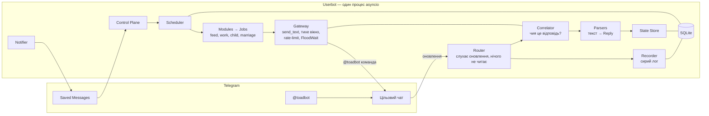
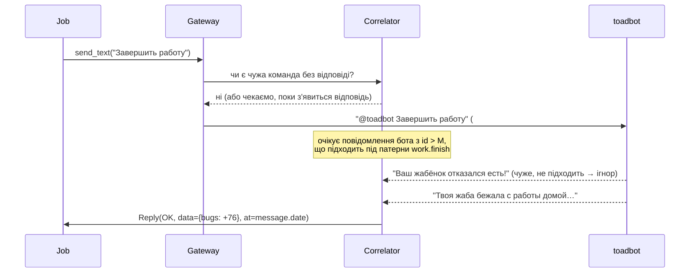

# Toad Userbot — архітектура

Юзербот (MTProto-клієнт від імені акаунта користувача), який автоматизує гру в [@toadbot](https://t.me/toadbot) в **одному конкретному чаті**. Жаба має 👑 Prime.

Джерела правил гри: [гайд](https://toadbot.info/guide/), [команди](https://toadbot.info/commands/), [донат](https://toadbot.info/donate/). Реальні відповіді бота зібрані в [BOT_REPLIES.md](BOT_REPLIES.md). Усе, що позначено **[перевірити]**, ще треба підтвердити на живих відповідях.

## 0. Прийняті рішення

| Питання | Рішення |
|---|---|
| Стек | Python 3.12 + Telethon |
| Керування | Команди в Saved Messages (`.status`, `.on work`, …) |
| Хостинг | VPS, Docker Compose |
| Архітектура функцій | **Модулі**: кожна активність — окремий модуль зі своїм вимикачем і налаштуваннями, які змінюються на льоту |
| Перші модулі | кормежка → робота (з вибором типу; авто-відправку й авто-завершення можна вимикати окремо) → жабеня / садок → брак |
| Откорм | **Не робимо** (можливий пізніше як окремий модуль, вимкнений за замовчуванням) |
| Взаємодія з ботом | **Лише текстові команди** у форматі `@toadbot <Команда>`. Кнопки не натискаємо: більшість із них (зі стрілкою ↗) — switch-inline, вони лише вставляють той самий текст |
| Час гри | **Фіксований UTC+3**, без переходу на літній час |
| Непомітність | Юзербот **не читає чат**: не позначає прочитаним, не опитує історію, не буває «онлайн» без потреби (бот мутить за часте читання — перевірено) |
| Якість коду | Професійне оформлення: шари, строга типізація, лінтер, тести, CI (див. §12) |

---

## 1. Ключові принципи

1. **Джерело правди — бот, а не наші таймери.** Локальний стан — лише кеш. Кожна дія: надіслати команду → дочекатися *нашої* відповіді → класифікувати → оновити стан → обчислити наступний запуск. Сліпих `sleep(6h)` немає.
2. **Якір часу — `message.date` відповіді бота** (серверний час Telegram), а не момент, коли ми надіслали команду, і не локальний годинник.
3. **Запас + джитер на кожен кулдаун.** `next = ready_at + margin + random(jitter)`. Бот показує залишок у форматі `5 ч:34 мин.`, округлюючи до хвилин, тому «0 ч:0 мин.» = ще до 59 с. Мінімальний запас — 60 с.
4. **Відповідь «ще рано» — корисна інформація, а не помилка.** Парсимо залишок і переплановуємо на нього.
5. **Непомітність.** Жодних подій читання, жодного опитування, жодних миттєвих реакцій. Юзербот лише слухає потік оновлень, який Telegram і так надсилає клієнту, і пише в чат, коли настав час дії.
6. **Одна команда в польоті.** Бот **не відповідає реплаєм**, тож відповідь визначаємо за порядком і змістом. Тому наша команда завжди одна, і ми не пишемо, поки бот ще не відповів на чужу команду.
7. **Невідоме → зупинитися і повідомити**, а не повторювати навмання. Circuit breaker на кожну джобу.
8. **Спостерігаємо й ручну гру.** Юзербот — це той самий акаунт, тож команди, які користувач пише руками з телефона, і відповіді на них теж оновлюють стан.
9. **Мінімум команд.** Ресинк через «Жаба инфо» — лише при старті, після аномалій і рідко за розкладом. Для MVP це ≈20 команд на добу.

---

## 2. Що з правил гри важливо для автоматизації

Час гри — **UTC+3**. Команди надсилаються як `@toadbot <Команда>` (префікс налаштовується).

| Активність | Команда(и) | Кулдаун / вікно | Вартість | Нюанси |
|---|---|---|---|---|
| Кормежка | «Покормить жабу» | **6 год** (Prime) | — | +1 🍰, +15 👻, букашки. Також реанімує. У «Жаба инфо»: `Покормить можно через 5 ч:34 мин.` |
| Откорм | «Откормить жабу» | 4 год | 500 🐞 | Не автоматизуємо |
| Робота | «Поход в столовую» / «Работа крупье» / «Работа грабитель» → «Завершить работу» | 2 год роботи; наступна відправка — **через 8 год від попередньої** | — | Тип роботи пишемо **одразу**, без меню (перевірено). Завершувати можна будь-коли після 2 год: 15:31 завершили — 15:32 відправили знову. Столова: −20 👻, можна побитою |
| Робота на карті | «Отправиться в кафетерий/казино/банк» → «Начать работу» | як робота | — | Інтерактив (замовлення, рулетка, валізи) — пізніше |
| Арена | «На арену» (реєстрація, той самий текст — атака) | Реєстрація 08:00–21:50, хв :00–:50; атака в наступну годину; результат :50–:00 | 100 🐞 | Результат бою приходить одразу фото з підписом `Победитель …!` |
| Туса | «Жабу на тусу», «Начать тусу» | 1 раз/добу | 150 🐞 | |
| Брак | «Брак вознаграждение» | 5 днів | — | +3 🍭, +5 🍰 обом |
| Жабеня | «Покормить жабенка» | 12 год | 75 🐞 | Може **відмовитися їсти** — букашки все одно списуються |
| Садок | «Отправить жабенка в детсад» / «Забрать жабенка» | Відправка **06:00–12:00**; забрати **між +6 і +8 год** | — | **Жорсткий дедлайн** — інакше «неприємності» |
| Махач жабенят | «Отправить жабенка на махач» | від +2 год після садка до забирання | — | |
| Подарунок жабеняті | «Сделать подарок» | 1 раз/добу | водорості/конфетка | |
| Клан, підземелля, огород, дейлики | див. гайд | | | Наступні модулі |
| Стан | «Жаба инфо» (`/toad_info@toadbot`), «Моя жаба», «Моя семья», «Мой инвентарь» | — | — | Джерела для синхронізації стану |

---

## 3. Компоненти



| Шар | Відповідальність |
|---|---|
| **Router** | Підписка на `NewMessage` / `MessageEdited` / `MessageDeleted` у цільовому чаті та в Saved Messages. Нічого не запитує в Telegram — лише приймає оновлення. Розподіляє: бот → Correlator, наші та чужі команди боту → Correlator (як «команда в польоті»), Saved Messages → Control Plane. |
| **Recorder** | Пише кожне повідомлення бота і кожну команду боту (текст, entities, кнопки, `date`, `id`) у `messages` одразу при отриманні: через ~5 хв бот усе видаляє. |
| **Correlator** | Зіставляє відповіді бота з командами (див. §4). |
| **Gateway** | Єдина точка запису в Telegram: `send_text(command) -> Reply`. Тихе вікно, один запит у польоті, мінімальний інтервал, стеля команд/год, `FloodWaitError`, dry-run. |
| **Parsers** | Чисті функції `(text, entities) -> Reply`. Спершу нормалізація (прибрати кастомні емодзі, зайві пробіли), далі патерни за ключовими фразами. Невідоме → `UNKNOWN`. |
| **State Store** | `ToadState`, `ChildState` і таблиця кулдаунів `action -> ready_at, source`. |
| **Scheduler** | Персистентна черга джоб з `next_run_at` і фазою state machine. |
| **Modules / Jobs** | Логіка активностей (див. §6). Не знають про Telethon. |
| **Control Plane / Notifier** | Команди власника і сповіщення в Saved Messages. |

---

## 4. Кореляція відповідей

Факти зі скрінів:
- бот відповідає **не реплаєм**, а звичайним повідомленням (часто фото з підписом);
- відповідь **не згадує власника** («Твоя жаба бежала с работы…», «Ваш жабёнок отказался есть!»);
- в чаті одночасно грають інші (на скріні: чужа «На арену» → результат бою → наша «/toad_info» → відповідь);
- відповідь приходить за кілька секунд, а через ~5 хв бот видаляє і команди, і відповіді.



**Алгоритм**
1. **Тихе вікно перед відправкою.** Router бачить чужі повідомлення, що звертаються до бота (`@toadbot …`, `/…@toadbot`, відомі тексти команд). Якщо на чужу команду ще не було відповіді, Gateway чекає, поки вона з'явиться. Далі — випадкова пауза 3–8 с. Якщо чекаємо довше 60 с, пишемо все одно, але з позначкою ризику.
2. **Очікувані патерни.** Кожна команда оголошує сімейство відповідей (`work.send`, `work.finish`, `info`…) плюс загальні відповіді («ще рано», «немає букашок», «жаба на роботі» — **[зібрати]**).
3. **Зіставлення.** Беремо перше повідомлення бота з `id > id нашої команди`, яке класифікується в очікуване сімейство. Решта йде в Recorder і, за потреби, в push-обробники.
4. **Неоднозначність.** Якщо між нашою командою і відповіддю з'явилась чужа команда того ж сімейства, у `Reply` ставимо `ambiguous=True`. Джоба не довіряє такій відповіді повністю й планує перевірку через «Жаба инфо».
5. **Таймаут** 30 с → `Reply(TIMEOUT)`. Команду **не повторюємо** — спершу ресинк.

**Модель відповіді**

```python
class ReplyKind(StrEnum):
    OK = "ok"
    COOLDOWN = "cooldown"  # є remaining
    REFUSED = "refused"  # дія відбулась, але без результату (жабеня не їло), ресурс витрачено
    NOT_ENOUGH_BUGS = "no_bugs"
    NEEDS_REANIMATION = "dead"
    TOAD_BUSY = "busy"  # на роботі, в поході, в підземеллі
    OUT_OF_WINDOW = "window"  # садок після 12:00
    UNKNOWN = "unknown"
    TIMEOUT = "timeout"


@dataclass(frozen=True, slots=True)
class Reply:
    kind: ReplyKind
    family: str  # "work.finish", "info", ...
    received_at: datetime  # message.date (сервер, UTC)
    remaining: timedelta | None
    data: Mapping[str, object]  # розпарсені поля
    raw_text: str
    ambiguous: bool = False
```

---

## 5. Непомітність

Бот мутить, якщо акаунт «часто дивиться в чат». Механізм нам неважливий: юзербот просто **не створює жодних сигналів, крім самих команд**.

| Правило | Як реалізовано |
|---|---|
| Не позначати прочитаним | Жодних `send_read_acknowledge`, `ReadHistoryRequest`, `ReadMentionsRequest`, `ReadReactionsRequest`. Обгортка клієнта не надає цих методів, а тест перевіряє, що їх ніде немає в коді |
| Не опитувати історію | Жодних `get_messages` / `iter_messages` у циклах. Стан отримуємо з потоку оновлень і з відповідей на наші ж команди. Після реконекту Telethon сам добирає пропущене через `getDifference` — це не читання |
| Не бути «онлайн» | Не викликаємо `account.UpdateStatus(offline=False)`. Telethon не робить цього сам. Онлайн з'являється лише в момент надсилання команди, як у людини |
| Не реагувати миттєво | Реакції на push-події (у майбутніх модулях) — з випадковою затримкою (типово 20 с – 3 хв). У MVP push-реакцій немає взагалі: усе за розкладом |
| Не писати часто | ~20 команд на добу для MVP, мінімум 4–9 с між командами, стеля на годину |
| Не «друкувати» | Не надсилаємо статус «typing…» |

**[перевірити]** Схоже, що надсилання повідомлення саме по собі позначає чат прочитаним на сервері. Для людини це природно: прочитав — написав. Частота таких подій = частоті команд, тобто рідко.

---

## 6. Планувальник і таймінги

### Чому «рівно 6 год» дає «0 хвилин»
- кулдаун рахується від моменту, коли **бот обробив** попередню кормежку, а не коли ми її надіслали;
- бот показує залишок з округленням до хвилин (`0 ч:0 мин.` = ще до 59 с);
- локальний `sleep` дрейфує, а після рестарту процесу таймер губиться.

### Правило обчислення наступного запуску

```
OK        → next = reply.received_at + cooldown + margin + U(jitter_min, jitter_max)
COOLDOWN  → next = now + remaining + 60s + U(30s, 120s)
            якщо remaining == 0 → next = now + U(60s, 120s); attempts += 1
            якщо attempts > 3   → ресинк і сповіщення
REFUSED   → як OK (ресурс витрачено, кулдаун пішов) [перевірити для жабеняти]
TIMEOUT / UNKNOWN / ambiguous → запланувати ресинк («Жаба инфо») і взяти час звідти
```

Для кормежки за замовчуванням: 6 год + 60 с + U(0, 4 хв), тобто «6 год 1–5 хв» від відповіді бота.

### Час гри
`GAME_TZ = timezone(timedelta(hours=3))` — фіксований зсув, без `zoneinfo`. Хелпер `TimeWindow` відкладає дію до початку вікна з джитером:
- садок: відправка `06:00–12:00` (типово `06:05–07:30` + джитер); забирання на `+6 год + U(2, 15 хв)`; **о +7:30 без забирання — алерт**;
- арена (пізніше): реєстрація `HH:01–HH:12`, атака `(H+1):01–(H+1):15`;
- «тихі години» (опційно): не надсилати некритичні команди вночі.

### Пріоритети і конфлікти
- `CRITICAL` (забрати жабеня, реанімація) > `HIGH` (кормежка, завершити роботу) > `NORMAL` > `LOW` (ресинк).
- Передумови джоб: `requires_healthy`, `requires_free_toad`, `min_bugs`, `window`. Не виконано → перенос, а не виконання.
- **Бюджет букашок:** `reserve_bugs` — платні дії не виконуються, якщо баланс після дії буде нижче резерву.

### Надійність
- Стан кожної джоби (`next_run_at`, фаза, спроби) — у SQLite. Після рестарту все продовжується з того ж місця + один стартовий ресинк.
- Порт `Clock` → у тестах час перемотується.

---

## 7. Модулі

Кожна активність — **модуль** у `modules/`: реєструє свої джоби, сімейства відповідей, спостерігачі й схему налаштувань. Ядро про конкретні активності нічого не знає.

```python
class Module(Protocol):
    name: str  # "feed", "work", "child", "marriage"
    settings_model: type[BaseModel]

    def jobs(self, settings: BaseModel) -> Sequence[Job]: ...
    def reply_families(self) -> Sequence[ReplyFamily]: ...
    def observers(self) -> Sequence[Observer]: ...  # реакція на РУЧНІ команди користувача


class Job(Protocol):
    name: str  # "work.send", "work.finish"
    priority: Priority
    toggle: str  # ключ вимикача

    def blocked_by(self, state: GameState, now: datetime) -> str | None: ...
    async def run(self, ctx: JobContext) -> Outcome: ...


@dataclass(frozen=True, slots=True)
class Outcome:
    next_run_at: datetime | None  # None = чекати зовнішньої події
    phase: str | None = None
```

**Правила модульності**
- Вимикачі на двох рівнях: модуль (`work`) і дія (`work.send`, `work.finish`). Вимкнений модуль вимикає всі свої дії.
- Налаштування за замовчуванням — у `config.yaml`. Зміни через `.on/.off/.set` зберігаються в БД і **переживають рестарт**.
- **Спостереження не вимикається.** Якщо ти відправив жабу на роботу руками, модуль побачить відповідь бота. Тоді, якщо `work.finish` увімкнено, заробіток забере юзербот.
- Модулі не викликають один одного напряму — лише через State і передумови.

### `feed` — кормежка
| Налаштування | Типово | Опис |
|---|---|---|
| `enabled` | `true` | вимикач |
| `cooldown` | `6h` | Prime |
| `margin` / `jitter` | `60s` / `0–4m` | «6 год 1–5 хв» від відповіді бота |

### `work` — робота
| Налаштування | Типово | Опис |
|---|---|---|
| `enabled` | `true` | вимикач модуля |
| `send` | `true` | **авто-відправка** |
| `finish` | `true` | **авто-завершення** |
| `kind` | `stolovaya` | `stolovaya` («Поход в столовую») / `krupie` («Работа крупье») / `grabitel` («Работа грабитель») |
| `kind_if_injured` | `stolovaya` | у столову можна піти побитою |
| `cycle` | `8h` | від відповіді на відправку до наступної відправки |
| `finish_jitter` | `1–10m` | після «закончит работу через 2 ч:0 мин.» |

State machine: `IDLE → send → WORKING (до t+2 год із відповіді) → finish → DONE → (t_send + 8 год + джитер) → IDLE`. Раннє завершення важливе лише тим, що звільняє жабу для інших дій (наприклад, у «Жаба инфо» підземелля «Недоступно во время работы»).

### `child` — жабеня і садок
| Налаштування | Типово | Опис |
|---|---|---|
| `feed` | `true` | «Покормить жабенка» кожні 12 год (75 🐞). Відмова їсти = `REFUSED`, повтор не раніше кулдауну |
| `kindergarten.send` | `true` | «Отправить жабенка в детсад» у `send_at` |
| `kindergarten.send_at` | `06:05–07:30` | вікно відправки (UTC+3) |
| `kindergarten.pickup` | `true` | «Забрать жабенка» на +6 год + 2–15 хв; алерт о +7:30 |
| `fight` | `true` | «Отправить жабенка на махач» після +2 год від садка |
| `gift.enabled` / `gift.item` | `false` / `vodorosli` | подарунок 1 раз на добу |

Садок: `HOME → KINDERGARTEN(t) → [FIGHT ≥ t+2 год] → PICKUP у [t+6, t+8] → HOME`. `pickup` підхоплює й ручну відправку.

### `marriage` — брак
| Налаштування | Типово | Опис |
|---|---|---|
| `reward` | `true` | «Брак вознаграждение» кожні 5 днів. Якщо партнер уже забрав нагороду, бот скаже, що рано, і ми переплануємо запуск за залишком |

### Ядро (не вимикається)
- `core.sync` — «Жаба инфо» при старті, після аномалій і раз на ~12 год. За потреби «Моя семья» для жабеняти.
- `core.health` — стан «нуждается в реанимации» → кормежка, якщо вона готова, або аптечка, або лише алерт.

### Наступні модулі
`arena`, `party`, `dailies`, `clan`, `dungeon`, `mapwork`, `garden`, `force_feed` (вимкнений), `toad_drop` (вимкнений).

### Приклад `config.yaml`

```yaml
chat_id: -1001234567890
bot_username: toadbot
command_prefix: "@toadbot "
game_utc_offset_hours: 3

stealth:
  command_gap_s: [4, 9]
  quiet_window_s: [3, 8]
  max_commands_per_hour: 12
  push_reaction_delay_s: [20, 180]

safety:
  dry_run: true
  reply_timeout_s: 30
  reserve_bugs: 1000

modules:
  feed:
    enabled: true
    cooldown: 6h
    margin: 60s
    jitter: [0s, 4m]
  work:
    enabled: true
    send: true
    finish: true
    kind: stolovaya
    kind_if_injured: stolovaya
    cycle: 8h
  child:
    enabled: true
    feed: true
    kindergarten: {send: true, send_at: ["06:05", "07:30"], pickup: true}
    fight: true
    gift: {enabled: false, item: vodorosli}
  marriage:
    enabled: true
    reward: true
```

---

## 8. Керування і сповіщення

Команди в **Saved Messages** (читання Saved Messages ніхто не бачить). Відповідь заміняє текст команди; невідома команда отримує окрему відповідь, щоб не зіпсувати звичайну нотатку. Команди, надіслані до старту процесу (їх повторює catch-up після рестарту), ігноруються.

**Базові команди — вже є (етап 0):**

```
.help                список команд
.ping                затримка до Telegram API
.status              акаунт, чат, бот, статистика запису
.uptime / .version   час роботи, версія і коміт
.cpu / .mem / .disk  ресурси процесу, контейнера і сервера
.sys                 хост, ОС, версії
.logs [N] [рівень]   хвіст логу, напр. .logs 50 error
.chats [фільтр]      групи та їхні id
.chat [set <id>|reset]  робочий чат (перекриття зберігається в БД)
.export [годин]      записані повідомлення у JSONL-файл
.restart             перезапуск процесу
```

**Для модулів (етап 1+):**

```
.modules             модулі та їхні вимикачі
.jobs                джоби: фаза, next_run_at, остання відповідь
.on  <модуль|дія>    .on work   .on work.send   .on child.fight
.off <модуль|дія>    .off feed  .off work.finish
.set <ключ> <знач>   .set work.kind krupie
.cfg <модуль>        налаштування модуля
.pause all           kill switch (зупинити все, крім спостереження)
.resume all
.run <дія>           виконати зараз (з перевіркою передумов)
.sync                примусовий ресинк
.dry on|off          dry-run: логувати, але не надсилати
.say <текст>         надіслати довільну команду боту через Gateway
```

Сповіщення: `UNKNOWN`-відповідь, circuit breaker, жаба побита, дедлайн садка під загрозою, баланс нижче резерву, щоденний дайджест.

---

## 9. Безпека і запобіжники

- **Allowlist:** пишемо лише в `chat_id` з конфігу; відповіді приймаємо лише від id @toadbot (резолвимо один раз).
- **Rate limit і `FloodWaitError`** — див. §5.
- **Circuit breaker:** 3 невідомі/невдалі відповіді поспіль → джоба на паузі + сповіщення.
- **Ідемпотентність:** жодних повторів без відповіді; при таймауті — ресинк.
- **Dry-run за замовчуванням** для першого запуску кожного модуля.
- **Секрети:** `API_ID`, `API_HASH`, сесія — у `.env` / Docker-секретах, поза git. Файл сесії = повний доступ до акаунта.

---

## 10. Зберігання (SQLite)

| Таблиця | Поля |
|---|---|
| `jobs` | `name` PK, `enabled`, `phase`, `next_run_at`, `attempts`, `last_kind`, `last_run_at`, `payload` JSON |
| `settings` | `key` PK, `value` JSON — перекриття `config.yaml` командами `.on/.off/.set` |
| `cooldowns` | `action` PK, `ready_at`, `source` (`reply` / `info` / `estimated`), `observed_at` |
| `snapshots` | `at`, `kind` (`toad` / `child`), `data` JSON |
| `messages` ✅ | сирий лог (кожна версія — окремий рядок `event = new/edit`): `chat_id`, `msg_id`, `sender_id`, `is_bot`, `is_outgoing`, `sent_at`, `edited_at`, `received_at`, `reply_to_msg_id`, `media`, `text`, `entities`, `buttons` |
| `deletions` ✅ | `chat_id`, `msg_id`, `deleted_at` |
| `meta` ✅ | `key` → `value`: кешований id бота, перекриття робочого чату |
| `unknown_replies` | `family`, `text`, `at`, `resolved` |
| `audit` | `at`, `job`, `command`, `reply_kind`, `details` |

Схема мігрується версіонованими SQL-файлами.

---

## 11. Структура проєкту

Позначки: ✅ — є з етапу 0, без позначки — з'явиться на наступних етапах.

```
src/toad_userbot/
  __main__.py                 # ✅ CLI: run | login | healthcheck
  app.py                      # ✅ composition root: збирає залежності, життєвий цикл
  config.py                   # ✅ Settings (.env) + AppConfig (config.yaml)
  runtime.py                  # ✅ спільний стан процесу: TargetChat, Shutdown, BuildInfo
  logging_setup.py            # ✅ structlog → stdout (JSON/console) + ротований файл
  domain/                     # чисте ядро, без I/O і без Telethon
    time.py                   # ✅ GAME_TZ (UTC+3), Clock
    durations.py              # «5 ч:34 мин.» → timedelta
    replies.py                # Reply, ReplyKind, ReplyFamily
    state.py                  # GameState, ToadState, ChildState, Cooldowns
    commands.py               # усі тексти команд в одному місці
  recorder/                   # ✅ етап 0: що записувати і як
    models.py                 # ✅ RecordedMessage, Entity, Button
    policy.py                 # ✅ бот + команди боту так, звичайні розмови ні
    service.py                # ✅ Recorder
  parsing/
    normalize.py              # прибрати кастомні емодзі, нормалізувати пробіли
    families/                 # info.py, feed.py, work.py, child.py, family.py, marriage.py
  engine/
    scheduler.py  job.py  registry.py  policies.py
  modules/
    core/  feed/  work/  child/  marriage/
  control/                    # ✅ контрол-плейн, без Telethon
    registry.py  parser.py  dispatcher.py  format.py  ports.py
    commands/                 # ✅ general.py, host.py, recording.py
  system/                     # ✅ metrics.py (psutil, cgroup), logtail.py, heartbeat.py
  storage/                    # ✅ єдине місце з aiosqlite
    db.py  repositories.py  migrations/0001_initial.sql
  telegram/                   # ✅ єдине місце з Telethon
    client.py                 # ✅ фабрика клієнта, правила непомітності, TelegramConnection
    serialize.py              # ✅ Telethon Message → RecordedMessage
    router.py                 # ✅ оновлення → Recorder / Control
    control_bridge.py         # ✅ виконання команд із Saved Messages, доставка відповідей
    info.py                   # ✅ ping, акаунт, пошук груп
    login.py                  # ✅ інтерактивний вхід
    correlator.py  gateway.py # етап 1
tests/
  unit/  integration/         # ✅
  test_architecture.py        # ✅ непомітність і межі шарів (AST)
  fixtures/replies/           # реальні тексти бота
docs/
  ARCHITECTURE.md  BOT_REPLIES.md  adr/
pyproject.toml  uv.lock  Makefile  .pre-commit-config.yaml  .github/workflows/ci.yml
Dockerfile  docker-compose.yml  .env.example  config.example.yaml  README.md
```

**Правило залежностей:** `domain` ← `parsing` ← `engine` ← `modules` ← `app`. Telethon імпортується **лише** в `telegram/`, `aiosqlite` — лише в `storage/`. Внутрішні шари (`domain`, `recorder`, `control`, `storage`, `system`) не імпортують `telegram` і `app`. Усе це перевіряє `tests/test_architecture.py`.

---

## 12. Стандарти коду

| Що | Як |
|---|---|
| Мова, пакети | Python 3.12, `src/`-layout, `uv` з lock-файлом |
| Стиль | `ruff` (lint + format), line length 100 |
| Типи | `mypy --strict`, без `Any` у публічних API; `Protocol` для портів (Gateway, Clock, Repository) |
| Моделі | `dataclass(frozen=True, slots=True)` для доменних значень, `pydantic` v2 — лише для конфігу |
| Тексти команд і патерни | Тільки в `domain/commands.py` і `parsing/families/` — без «магічних рядків» по коду |
| Логування | `structlog`, JSON у проді; кожна команда має `correlation_id` |
| Помилки | Власна ієрархія винятків; жодних «голих» `except` |
| Документація | Google-style docstrings для публічного API; ADR на кожне суттєве рішення |
| Мова коду | Ідентифікатори, docstrings і коміти — англійською. Документація — українською. Тексти команд гри — як у бота (російською) |
| Тести | `pytest`, `pytest-asyncio`; покриття `domain` + `parsing` + `engine` ≥ 90% |
| Якість | `pre-commit` (ruff, mypy, перевірка секретів). CI у GitHub Actions: lint → types → tests → build образу |
| Коміти | Conventional Commits (`feat:`, `fix:`, `docs:`…) |
| Docker | Multi-stage, non-root користувач, `healthcheck`, том для `data/` (БД + сесія) |

---

## 13. Тестування

- **Парсери:** golden-тести на реальних текстах ([BOT_REPLIES.md](BOT_REPLIES.md) → `tests/fixtures/replies/`). Кожен новий `UNKNOWN` → нова фікстура → новий патерн.
- **Тривалості:** `5 ч:34 мин.`, `2 ч:0 мин.`, `0 ч:0 мин.`, варіанти з днями **[зібрати]**.
- **Кореляція:** сценарії з чужими командами між нашою командою і відповіддю (як на скріні з ареною).
- **Планувальник:** FakeClock — «прожити» тиждень за секунду. Перевіряємо, що кормежка жодного разу не пішла раніше кулдауну, садок завжди забраний у [+6, +8], команд не більше ліміту.
- **Непомітність:** тест, що в коді немає викликів методів читання й опитування.
- **Живий прогін:** dry-run у цільовому чаті, потім увімкнення модулів по одному.

---

## 14. Roadmap

| Фаза | Зміст | Готово, коли |
|---|---|---|
| **0. Скелет + Recorder** ✅ | Інструменти (pyproject, ruff, mypy, CI, Docker), логін, Router + Recorder, базові контрол-команди (`.help`, `.ping`, `.status`, `.cpu`, `.mem`, `.disk`, `.logs`, `.export`…). Юзербот нічого не пише в чат, лише записує. Кілька днів – тиждень ручної гри | Зібрано відповіді, яких ще немає в [BOT_REPLIES.md](BOT_REPLIES.md); `.export` → фікстури |
| **1. Ядро + `feed`** | Gateway, Correlator, Parsers, Scheduler, SQLite, реєстр модулів, Control Plane, Notifier, `core.sync`, `core.health`, `feed` | Тиждень без жодного «ще рано» на кормежці; `.off/.on feed` на льоту; рестарт нічого не ламає |
| **2. `work`** | Тип роботи, окремі `send` / `finish`, столова для побитої жаби, спостереження за ручною відправкою | Доба без втручання з різними комбінаціями вимикачів |
| **3. `child` + `marriage`** | Годування, садок із жорстким вікном, махач, подарунок; нагорода за брак | FakeClock: садок завжди в [+6, +8]; тиждень наживо без алертів |
| **4. Далі за бажанням** | `arena`, `party`, `dailies`, `clan`, `dungeon`, `mapwork`, `garden` | |

---

## 15. Ризики і відкриті питання

**Ризики**
- **Мут від бота.** Головний захист — §5. Нові модулі з push-реакціями (арена, казино) — найризикованіші, тож робимо їх останніми.
- **Акаунт Telegram.** Спамоподібна автоматизація може призвести до обмежень; частота команд у нас низька.
- **Правила гри.** Адміністрація @toadbot може вважати автоматизацію порушенням.
- **Зміна текстів бота** → `UNKNOWN`-алерти + circuit breaker + нові фікстури.

**[перевірити / зібрати]**
- Успішна кормежка і відповідь «ще рано» на «Покормить жабу».
- Стани рядка роботи в «Жаба инфо» (крім «Завершай работу») і рядка кормежки, коли вже можна.
- Відповідь на відправку в роботу, коли 8 год ще не минуло.
- Садок: відправка, «ще рано забирати», забирання, махач; чи стартує 12-год кулдаун жабеняти після відмови їсти.
- «Брак вознаграждение»: успіх і «ще рано».
- «Недостаточно букашек», «жаба побита» — загальні відповіді.
- Формат тривалості з днями (для браку — 5 днів).
